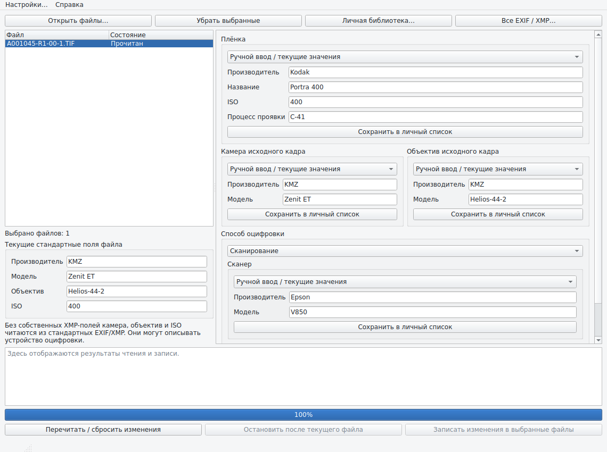
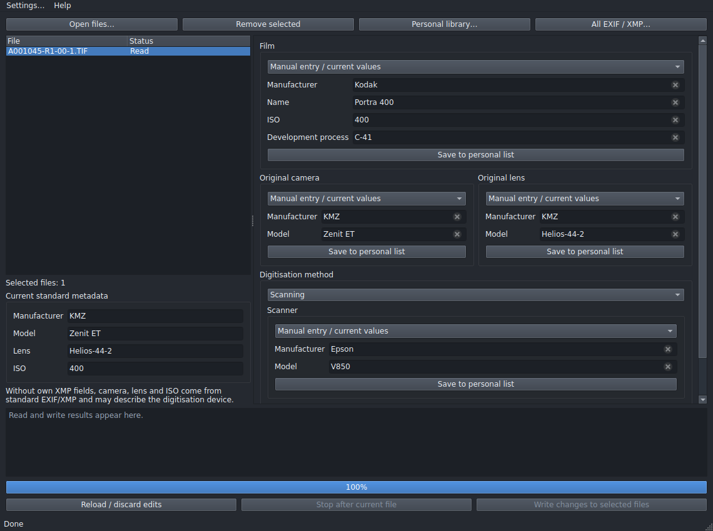
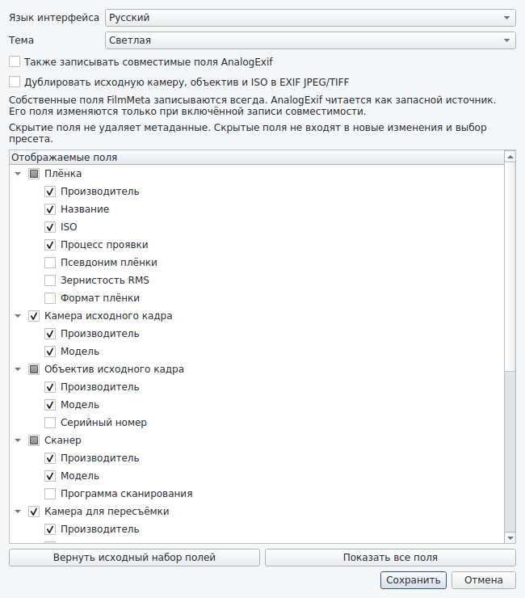

<p align="center">
  
</p>

<h1 align="center">FilmMeta</h1>

**Version 0.1.4** · Python + PySide6 · Russian and English interfaces

FilmMeta is a small desktop application for assigning metadata to digitised film photographs. Open one or several images, inspect their current values, choose your own equipment and film presets or enter values manually, then write the edited fields into the selected files.

Photographs stay in their existing folders. FilmMeta stores only your personal presets in JSON; it does not build a photo catalogue.



## Features

- Personal lists of films, cameras, lenses and scanners.
- Film manufacturer, name, nominal ISO and development process.
- Independent original camera/lens and digitisation equipment.
- Scanner and camera reproduction modes.
- Manual entry without automatically adding anything to a personal list.
- Automatic reading when files are selected; mixed values are explicitly identified.
- A separate view of standard camera, lens and ISO fields plus a complete EXIF/XMP viewer.
- Batch editing that applies only changed, nonempty fields.
- Background reading and writing, with cancellation between files.
- Embedded XMP, optional original-camera EXIF mirroring for JPEG/TIFF, verification and unique backups.
- Own XMP fields by default, with AnalogExif reading and optional compatibility writing.
- Optional film alias/grain/format, frame/roll/filter, development/lab, lens serial and scanning-software fields.
- Per-field display choices, Russian/English interface and light/dark themes; persistent settings.

## Requirements

- Python 3.10 or newer, using a platform with available PySide6 and pyexiv2 wheels. A 64-bit Python installation is recommended for large images.
- `PySide6 >= 6.8, < 7`
- `pyexiv2 >= 2.16, < 3`

No ExifTool executable, SQLite database, server or account is required.

## Run from source

On Windows, open a terminal in this folder:

```powershell
py -m pip install -r requirements.txt
py run_filmmeta.py
```

On Linux or macOS:

```bash
python3 -m pip install -r requirements.txt
python3 run_filmmeta.py
```

The package entry point is also available:

```powershell
python -m filmmeta
```

To print the application version without opening a window:

```bash
python run_filmmeta.py --version
```

Keep the `filmmeta/` package next to `run_filmmeta.py`. The launcher is not a
standalone copy of the application. Existing personal lists remain compatible;
the application name, per-user data location and JSON schema have not changed.

## Quick start

1. Click **Open files…** to open photographs. Newly added files and existing files are selected together.
2. Select the files you want to inspect or edit. Shared values are shown in the forms; differing values show **Mixed values**.
3. Select a preset or edit the desired fields manually. Click **Save to personal list** only if you want that entry saved as a preset.
4. Set **Scanning** or **Camera reproduction** when the digitisation method needs to be recorded.
5. Click **Write changes to selected files**. The log reports the result and backup filename for each image.

Blank fields preserve the existing value; they do not delete a tag. Merely viewing metadata does not mark anything for writing. Changing the file selection discards unapplied form edits. **Reload / discard edits** reloads the current selection.

If any selected file fails to read, writing remains disabled. Remove that file from the selection or resolve its access problem and reload the selection.

**Personal library…** provides separate lists and add, edit and delete actions. The dialog displays the exact location of `library.json`; it is stored in the platform's per-user application-data folder, independently of the executable.

## Settings and optional fields

Open **Settings…** in the menu bar to select Russian or English,
light or dark theme, compatibility writing and the individual displayed fields.
These settings take effect immediately and are saved in `settings.json` beside
`library.json`. The defaults are Russian, light theme and the original field set.
Changing language or theme retains the file selection and pending form edits.

Additional fields are hidden initially:

- Film alias, RMS grain and format.
- Frame number, roll ID and filter.
- Developer manufacturer/name, dilution, development time and processing lab/address.
- Original/reproduction lens serial number and scanning software.

The field tree groups original and reproduction equipment separately.
**Restore default fields** restores the original
set; **Show all fields** enables every field. Scanning and
reproduction groups still follow the selected digitisation method.

Hiding fields does not modify files. Hidden fields are excluded from preset
application and writing; pending edits to a field are dropped when it is hidden.
Other pending edits remain. Existing hidden metadata is still read and appears
in the full EXIF/XMP viewer. Optional film/equipment values can be stored in the
existing personal lists; frame and development information are per-image fields.





## Metadata policy

| Format | Original film exposure | Standard EXIF fields |
| --- | --- | --- |
| JPEG / classic TIFF | Own embedded FilmMeta XMP; optional AnalogExif copies | Optional mirroring of edited original camera, lens/serial and ISO fields |
| DNG using classic TIFF layout | Own embedded FilmMeta XMP; optional AnalogExif copies | Technical digitisation EXIF remains unchanged |

FilmMeta writes changed nonempty values to its own namespace
`urn:filmmeta:metadata:1.0/`, normally using prefix `fm`. `fm:SchemaVersion`
remains `1`. Own values take precedence when reading. Missing values fall back
to the [AnalogExif schema](https://analogexif.sourceforge.net/help/analogexif-xmp.php).
Simply opening or inspecting a file never changes it.

**Also write compatible AnalogExif fields** is disabled by default. Enabling it
copies subsequent edited compatible values to AnalogExif as well as FilmMeta;
it does not migrate or rewrite files when the setting is changed. With the
option off, existing AnalogExif fields are preserved, including during an
explicit digitisation-mode change.

| Form field | Own property, always written on edit | Optional compatibility property |
| --- | --- | --- |
| `film.manufacturer` | `fm:FilmManufacturer` | `AnalogExif:FilmMaker` |
| `film.name` | `fm:FilmName` | `AnalogExif:Film` |
| `film.process` | `fm:FilmProcess` | `AnalogExif:DevelopProcess` |
| `scanner.manufacturer` | `fm:ScannerMake` | `AnalogExif:ScannerMaker` |
| `scanner.model` | `fm:ScannerModel` | `AnalogExif:Scanner` |
| `film.alias` | `fm:FilmAlias` | `AnalogExif:FilmAlias` |
| `film.grain` | `fm:FilmGrain` | `AnalogExif:FilmGrain` |
| `film.type` | `fm:FilmType` | `AnalogExif:FilmType` |
| `exposure.number` | `fm:ExposureNumber` | `AnalogExif:ExposureNumber` |
| `exposure.roll_id` | `fm:RollId` | `AnalogExif:RollId` |
| `exposure.filter` | `fm:Filter` | `AnalogExif:Filter` |
| `lens.serial` | `fm:OriginalLensSerialNumber` | `AnalogExif:LensSerialNumber` |
| `scanner.software` | `fm:ScannerSoftware` | `AnalogExif:ScannerSoftware` |
| `development.manufacturer` | `fm:DeveloperMake` | `AnalogExif:DeveloperMaker` |
| `development.name` | `fm:DeveloperName` | `AnalogExif:Developer` |
| `development.dilution` | `fm:DeveloperDilution` | `AnalogExif:DeveloperDilution` |
| `development.time` | `fm:DevelopTime` | `AnalogExif:DevelopTime` |
| `development.lab` | `fm:Lab` | `AnalogExif:Lab` |
| `development.lab_address` | `fm:LabAddress` | `AnalogExif:LabAddress` |

`AnalogExif:Film` and `AnalogExif:Scanner` include their manufacturer. FilmMeta
forms and own properties keep the inputs separate. Compatibility writing
combines names per file, avoiding a repeated manufacturer, and updates the full
name when only its manufacturer is edited. Shared names are split using their
shared manufacturer even when the own manufacturer differs.

AnalogExif registers `http://analogexif.sourceforge.net/ns`; Exiv2 normalises it
to `http://analogexif.sourceforge.net/ns/` in embedded XMP. FilmMeta registers the
same URI. The namespace URI and property name identify a field; XML prefixes
can differ.

Own-only properties include `fm:FilmISO`, `fm:OriginalCameraMake/Model`,
`fm:OriginalLensMake/Model`, `fm:DigitizationType` (`scan` or `camera`),
`fm:DigitizerCameraMake/Model` and `fm:DigitizerLensMake/Model/SerialNumber`.
`fm:PreviousDigitizerExif` retains a JSON snapshot of previous standard equipment
and ISO tags before the first mirroring write. Earlier FilmMeta properties and
0.1.3 AnalogExif values remain readable.

Standard EXIF mirroring is a separate option, disabled by default. It can be
changed in the main window or Settings and is saved. When enabled for JPEG/TIFF,
the corresponding standard XMP equipment/ISO tags are synchronised as well.
For files without own values, those standard tags may describe digitisation
rather than the original camera; FilmMeta cannot infer their provenance.

For DNG, standard equipment values remain in the read-only panel. They never
silently populate original camera/lens/film ISO fields. If the digitisation
method is recorded in FilmMeta XMP or identified by AnalogExif scanner tags,
missing fields for that digitisation device may fall back to technical EXIF.
An explicit FilmMeta method takes priority over inferred scanning.

Explicitly switching methods clears incompatible own scanner/reproduction
properties. Compatible scanner properties are cleared only when AnalogExif
writing is enabled. Unrecognised custom properties remain untouched. Hiding a
field itself does not clear anything.

The app does not import `.ael` libraries or implement every AnalogExif editing
feature. Interoperability checks use independently authored XMP fixtures; a
round trip through the actual AnalogExif GUI has not been performed. Generic
photo applications may not display custom properties in their normal panels.

## Paths, backups and limitations

Python opens the image using the chosen path and supplies its bytes to `pyexiv2.ImageData`. The native metadata engine never receives the filename, avoiding its filename encoding problems. Mapped drives and UNC paths remain subject to normal Windows access permissions and availability.

Files are processed one at a time. The metadata engine works on an in-memory copy; large images require several times their file size in available memory. Pixel data is not decoded and re-encoded through an image editor.

Each successful write:

1. Modifies metadata in memory.
2. Reopens the result and verifies the changed tags.
3. Writes a temporary file in the original directory.
4. Creates a unique backup of the original (`photo.tif.filmmeta.bak`, then `.filmmeta.1.bak`, etc.).
5. Replaces the original file, provided its size/time/identity has not changed during processing.

Failed writes leave the original image untouched. A backup may remain if the final replacement fails. The source folder must allow creation and replacement of files. Cancellation takes effect between files; an image already being processed completes first.

This release excludes BigTIFF containers, files at or above 1 GB for writing, and files at or above 2 GB for reading. BigTIFF's 64-bit offsets are distinct from pixel/channel bit depth. Classic TIFF float64 sample data is included in the automated checks.

Proprietary RAW, sidecars, metadata deletion and roll/catalogue management are outside this release's scope.

## Windows executable

Install the optional packaging tool, then build on Windows:

```powershell
py -m pip install -r requirements.txt PyInstaller
py -m PyInstaller --clean --noconfirm FilmMeta.spec
```

Alternatively, run `build_windows.cmd` after installing the dependencies. The
spec builds one executable without a console and includes the native metadata
library, application icon and component notices. The result is
`dist/FilmMeta.exe`. A Windows executable is not included in this source archive;
Windows packaging and startup still require a native Windows check.

## Tests

```bash
python -m pip install -r requirements-dev.txt
QT_QPA_PLATFORM=offscreen python -m pytest -q
```

In Windows PowerShell:

```powershell
$env:QT_QPA_PLATFORM = "offscreen"
py -m pytest -q
```

The tests cover Unicode paths, existing EXIF/XMP, JPEG/TIFF/DNG metadata round
trips, float64 TIFF pixel preservation, backup contents, failure handling, JSON
preset persistence, Qt selection/edit behaviour and the two launchers. See
[VALIDATION.md](VALIDATION.md) for the recorded environment and remaining checks.

## Documentation

- [VALIDATION.md](VALIDATION.md) — automated validation and limitations;
- [ARCHITECTURE.md](ARCHITECTURE.md) — module boundaries and metadata workflow;
- [THIRD_PARTY_NOTICES.md](THIRD_PARTY_NOTICES.md) — runtime component notices.

## Author and licensing

Author: **Mikhail Mirushchenko** · miruschenko98@gmail.com.

Original FilmMeta source is licensed under the [MIT License](LICENSE).
Third-party components retain their own licenses; see
[THIRD_PARTY_NOTICES.md](THIRD_PARTY_NOTICES.md).

Distributing FilmMeta together with GPL-licensed pyexiv2 must comply with the
GPL for the combined application, including corresponding-source requirements.
MIT licensing of the original source does not waive these obligations. See the
[GNU GPL FAQ on GPL libraries](https://www.gnu.org/licenses/gpl-faq.html#IfLibraryIsGPL).
